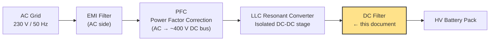

# DC-Side EMI Filter for an OBC


An **On-Board Charger (OBC)** is the power-electronics box inside an EV that turns AC wall/charging-station power into the DC voltage needed to charge the traction battery (400 V or 800 V class packs are typical).



The LLC resonant converter switches at high frequency (commonly 100 kHz–500 kHz). Even after the transformer and rectification, the DC bus carries:

- **Ripple at the switching frequency and its harmonics** (differential-mode, line-to-line)
- **Common-mode (CM) noise** — currents that flow through parasitic capacitances (transformer interwinding capacitance, heat-sink coupling, cable-to-chassis capacitance) equally on both output conductors, returning through the chassis

Both must be attenuated before the DC leaves the module and heads to the battery, to satisfy the automotive conducted-emissions standard **CISPR 25**.

```mermaid
flowchart LR
    subgraph SRC["Source"]
        V["V source<br/>Rdc1 = 1 µΩ"]
    end

    subgraph IN["Input Capacitor Cluster (4 cells, X-type)"]
        direction TB
        IN2["4× 1st filter stage caps<br/>6 µF / 7 mΩ / 9e-9H"]
    end

    subgraph CMC["Common-Mode Choke"]
        direction TB
        W1["Winding A: 3 mH / 3 mΩ"]
        W2["Winding B: 3 mH / 3 mΩ"]
        C1["3 pF across winding A"]
        C2["3 pF across winding B"]
        K["k = 0.99625"]
    end

    subgraph OUT["Output Capacitor Cluster (3 cells, X-type)"]
        direction TB
        O1["Co24: 3µF / 50mΩ / 2e-9H"]
        O2["Co3: 4.7 µF / 4.7 mΩ / 25 nH"]
        O3["Co4: 4.7 µF / 4.7 mΩ / 25 nH"]
    end

    VM["Vm1<br/>(ideal voltmeter)"]

    SRC -- "Bus A (top)" --> IN
    SRC -- "Bus A (bottom)" --> IN
    IN --> CMC
    CMC -- "Bus B (top)" --> OUT
    CMC -- "Bus B (bottom)" --> OUT
    OUT --> VM

    style CMC fill:#cdeaff,stroke:#333,stroke-width:2px
    style IN fill:#fff3b0,stroke:#333,stroke-width:1px
    style OUT fill:#e6d6ff,stroke:#333,stroke-width:1px
```


- **Top conductor** and **bottom conductor** together form a single floating differential pair (think: DC+ and DC−, or "line" and "return").
- Every RLC "cell" in both clusters is wired **across** the two conductors (a shunt / X-capacitor), not in series along one conductor.
- The **only series element in the entire path** is the CMC — one winding sits in the top conductor, the other winding sits in the bottom conductor, and they are magnetically coupled.

### The Input Capacitor Cluster
----
This cluster represents two things placed physically close together on the DC bus, lumped into one simulation node because there's no meaningful impedance between them on a PCB/bus-bar scale:

| Sub-group | Cells | C/cell | ESR/cell | ESL/cell | Represents |
|-----------|-------|--------|----------|----------|------------|
| First DC filter stage | 4 | 6 µF | 7 mΩ | 9e-9H | Dedicated larger-value filter caps, first EMI attenuation stage |

**Combined (all 12 in parallel):**

```
C_eff   ≈ 8×3µF + 4×6 µF   = 22.0 µF
1/R_eff = 8/50mΩ + 4/7 mΩ   →  R_eff ≈ 3.94 mΩ
1/L_eff = 8/2e-9H + 4/9e-9H   →  L_eff ≈ 0.192 nH
```

 Why spread capacitance across many parallel cells?

1. **Thermal spreading** — ripple-current I²R heating is distributed across more components.
2. **Current sharing** — no single capacitor carries the full ripple current.
3. **Lower effective ESL** — N identical caps in parallel divide ESL by N: `L_eff = L_cell / N`.
4. **Layout reality** — capacitors are physically spread along a bus bar; each really does have a slightly different parasitic loop.

### Self-resonant frequency (SRF)
---
A neat and easy-to-miss algebra fact: for **N identical cells in parallel**, `L_eff = L/N` and `C_eff = C·N`, so the product `L_eff · C_eff = L·C` is **unchanged**. The SRF of a parallel bank of identical cells is therefore *exactly the same* as the SRF of one cell:

```
f_SRF = 1 / (2π√(L·C)) = 1 / (2π√(2.5e-9 × 0.25e-6)) ≈ 6.37 MHz
```

*(The previous draft of this document stated ~18 MHz for the 8-cell bank — that was a mistake; the correct value, confirmed above, is 6.37 MHz, identical to a single cell.)*

Above 6.37 MHz, each of these small capacitors starts to look inductive rather than capacitive.

### The Common-Mode Choke
---
A common-mode choke is two windings, one per conductor, wound on a shared magnetic core so that:

| Current type | What happens in the core | Impedance seen |
|--------------|--------------------------|----------------|
| **Differential** (equal & opposite currents on the two conductors — the "useful" DC/ripple current) | The two windings' fluxes largely **cancel** | Very low (only the *leakage* inductance) |
| **Common-mode** (equal, same-direction currents on both conductors, e.g. noise returning via chassis) | The two windings' fluxes **add** | Very high (full self-inductance) |

This is what lets one small component pass the DC charging current with negligible loss while presenting a large blocking impedance to CM noise.

```
selfInductance_LLC     = [3, 3] mH                →  L = 3 mH per winding
windingResistance_LLC  = [3, 3] mΩ                →  R = 3 mΩ per winding
Kcmc_LLC               = 0.99625                  →  coupling coefficient k
Lm_LLC                 = L · k = 2.989 mH         →  mutual inductance M
```

From these, the two quantities that actually matter for filtering:

**Differential-mode leakage inductance** (what the "useful" signal sees, summed over both windings around the loop):

```
L_leak(DM) = 2 × L×(1 − k)   = 2 × 3 mH × (1 − 0.99625) = 2 × 11.25 µH ≈ 22.5 µH
R(DM)      = 2 × 3 mΩ        = 6 mΩ
```

A coupling coefficient of 0.99625 is a realistic, well-wound CMC — only 0.375% of the flux fails to cancel, leaving a small but non-zero series inductance in the DM path. This is intentional: filter designers often *want* a modest residual DM leakage inductance from the CMC, because it adds a "free" extra pole to the differential-mode LC filter without needing a separate DM choke.

**Winding self-capacitance:** each winding has a **3 pF** capacitor wired directly across its own two terminals (`C1` across the top winding, `C2` across the bottom winding). This is not a Y-safety-capacitor (those are nanofarad-scale, chassis-referenced, and safety-agency rated) — 3 pF is far too small and, critically, it is *not* connected to ground anywhere. It represents the **inter-winding/turn-to-turn parasitic capacitance** that every real wound inductor has. It is what makes a physical choke stop behaving like a choke at high frequency.

### The CMC's own self-resonance
---
Because `C1`/`C2` sit in parallel with each winding's own (R + jωL) branch, they form a **parallel resonant tank** with that winding, not a series one. A parallel LC tank has *maximum* impedance at resonance — the opposite of a series LC notch filter.

```
f_SRF(CMC winding) = 1 / (2π√(L × C)) = 1 / (2π√(3e-3 × 3e-12)) ≈ 1.68 MHz   (using full self-inductance)
```

But because the winding's *effective* series inductance in the DM loop is the much smaller leakage value, the tank that actually matters for the differential-mode signal resonates far higher:

```
f_SRF(CMC, DM leakage path) = 1 / (2π√(L_leak × C)) ≈ 1 / (2π√(11.25e-6 × 3e-12)) ≈ 27.4 MHz
```

**This is the real cause of the deepest notch in the Bode plot** (see Section 10) — around this frequency the choke's own parasitic capacitance and its leakage inductance anti-resonate, momentarily presenting a *very large* series impedance to the differential path, which produces the sharpest attenuation feature in the whole curve. Above that frequency, the parasitic capacitance takes over and the choke's impedance *collapses*, which is why filtering performance falls apart above ~30–50 MHz.


### The Output Capacitor Cluster
---
Three RLC cells, all wired directly across the two output conductors, right where `Vm1` measures the output voltage:

| Cell | C | ESR | ESL | Individual SRF |
|------|---|-----|-----|----------------|
| Co24 | 3µF | 50mΩ | 2e-9H | 6.37 MHz |
| Co3 | 4.7 µF | 4.7 mΩ | 25 nH | — |
| Co4 | 4.7 µF | 4.7 mΩ | 25 nH | — |

Co3 and Co4 are identical and effectively in parallel:

```
C_eff (Co3∥Co4) = 9.4 µF        
L_eff           = 25 nH / 2                   = 12.5 nH
f_res           = 1 / (2π√(12.5e-9 × 9.4e-6)) ≈ 417 kHz
```

*(The previous draft computed this as ~13.2 MHz — that was an arithmetic slip; ~417 kHz is correct and, reassuringly, lines up almost exactly with a deep notch actually visible in the Bode plot around 400–450 kHz — see Section 10.)*

Total output-side capacitance across all three cells: `0.25 + 4.7 + 4.7 = 9.66 µF`.


### Why Real Capacitors Are Modeled as RLC, Not Ideal C
---
An ideal capacitor has impedance `Z = 1/(jωC)`, which falls forever as frequency rises. A real capacitor has parasitic series resistance (ESR, from electrode and termination losses) and parasitic series inductance (ESL, from leads, internal geometry, and PCB pads):

```
Z_real(f) = R + jωL + 1/(jωC)
```

This means every real capacitor has three regimes:

- **Below its SRF:** capacitive — impedance falls with frequency (does its job as a filter cap)
- **At its SRF:** purely resistive, minimum impedance = ESR
- **Above its SRF:** inductive — impedance *rises* with frequency (stops filtering, starts looking like a small inductor)

Modeling every capacitor bank as N parallel RLC cells (rather than one lumped ideal capacitor) is what allows this simulation to correctly predict the notches, the anti-resonance peak, and the eventual loss of high-frequency performance — none of which an ideal-capacitor model could produce. This is standard, necessary practice for any EMI filter simulation meant to be trusted against real hardware measurements or a network analyzer sweep.


### The Transfer Function, Derived and Verified


Because the input capacitor cluster sits directly across the (nearly ideal) voltage source, with only the negligible 1 µΩ `Rdc1` in between, **it draws current but cannot change the voltage that the CMC "sees."** The entire shape of `H(f)` is therefore governed by just two things:

1. The CMC's differential-mode series impedance, `Z_CMC(f)` — combining leakage inductance, winding resistance, and the parasitic self-capacitance's anti-resonance
2. The output capacitor cluster's shunt impedance, `Z_out(f)` — the parallel combination of the three output RLC branches

To first order, this collapses to a simple voltage divider:

```
H(f) ≈ Z_out(f) / (Z_CMC(f) + Z_out(f))
```


##  Bode Plot, Zone by Zone

#### Zone 1 — 10 Hz to a few kHz: Passband (0 dB, 0°)
---
At these frequencies every capacitor's impedance is enormous and every inductor's is negligible, so the whole network is transparent. This is required — the actual DC charging current and any low-frequency ripple must pass essentially undisturbed.

#### Zone 2 — ~8–15 kHz: The +45 dB Anti-Resonance Peak
---

This is the single most important feature in the plot, and now has a precise, verified cause:

```
f_peak = 1 / (2π√(L_leak(DM) × C_out,total)) = 1 / (2π√(22.5 µH × 9.66 µF)) ≈ 10.8 kHz
```

This is a **series LC resonance between the CMC's differential-mode leakage inductance and the total output capacitance**. At this one frequency, the series combination `Z_CMC + Z_out` in the voltage-divider denominator becomes very small (limited only by the small series resistances), so `H(f)` spikes well above 0 dB — the filter *amplifies* rather than attenuates at this exact frequency.

**Why this matters:** if the LLC converter's switching frequency (or a sub-harmonic of it, e.g. from burst-mode operation at light load) ever falls near 10–11 kHz, this network will make the noise at the output *worse*, not better, by roughly 45 dB. This needs explicit verification against the LLC's actual minimum operating/switching frequency.

**Typical mitigations** (standard EMI-filter damping techniques, applicable here):
- Add a small resistor in series with (or a parallel RC "snubber" across) part of the output capacitor bank to damp the resonance
- Slightly increase the CMC's leakage inductance and/or a component's ESR deliberately to lower the Q of this resonance
- Add a dedicated damping network (parallel RC leg) sized to critically damp this specific LC pair
- Verify by simulation/measurement that the LLC's fundamental and relevant harmonics avoid the 8–15 kHz window

#### Zone 3 — ~15 kHz to ~1 MHz: First Deep Notch (~−88 dB at ~420 kHz)
---

Caused by the Co3/Co4 pair (4.7 µF, 25 nH each) resonating together at ~417 kHz, which is exactly the frequency at which the output cluster's own impedance `Z_out(f)` hits its minimum (limited by their 4.7 mΩ ESR). Per the voltage-divider relation, a minimum in `Z_out` produces a minimum (notch) in `H(f)`.

A −88 dB notch corresponds to roughly 25,000× attenuation in voltage amplitude — this is the network's primary working region for suppressing switching-frequency harmonics in the hundreds-of-kHz range.

#### Zone 4 — ~1–5 MHz: Partial Recovery
---

Between the Co3/Co4 resonance (~420 kHz) and the Co24 cell's own resonance (~6.37 MHz), the two branches of the output cluster briefly present an *anti-resonance* to each other (their individual capacitive/inductive regions don't line up), so the combined `Z_out` rises again, and `H(f)` recovers partway back up (still well below 0 dB, but less negative — consistent with the visible "bump" in this region of the plot).

#### Zone 5 — ~5–15 MHz: Secondary Dip
---

As the Co24 cell (3µF / 2e-9H) crosses its own 6.37 MHz SRF and starts going inductive, `Z_out` dips again, producing the secondary notch region seen just above the recovery bump.

#### Zone 6 — ~15–50 MHz: The Deepest Notch (~−124 dB at ~27.5 MHz)
---

This is **not** caused by the output capacitor cluster — it's caused by the **CMC itself**. As derived in Section 5, the CMC's 3 pF winding self-capacitance anti-resonates with its own leakage inductance right around this frequency, briefly presenting a very large series impedance in the differential path. Per the voltage-divider relation, a large `Z_CMC` (much larger than `Z_out`) drives `H(f)` toward zero — the deepest, sharpest notch in the whole sweep.

This is a genuinely elegant (if unintentional-looking) design outcome: the same parasitic effect that eventually degrades the choke's performance at very high frequency is, right at its own resonance, responsible for the single best attenuation point in the entire filter.

#### Zone 7 — Above ~50 MHz: Rising Floor, Filter Degrades
---

Past its own self-resonance, the CMC's parasitic capacitance takes over and its impedance falls with frequency instead of rising — it stops acting like an inductor at all. At the same time, every capacitor in the circuit is now well above its own SRF and looks inductive rather than capacitive. With both the "series L" element and the "shunt C" elements behaving backwards from their intended roles, the network loses its low-pass character entirely, and `H(f)` climbs back toward 0 dB (and, in the fully parasitic-dominated regime toward 1 GHz, potentially above it).

**Relevance to CISPR 25:** the strictest automotive class (Class 5) requires conducted-emission compliance up to 108 MHz. Filter performance visibly degrading above ~50 MHz means the 76–108 MHz FM broadcast band sits right in the region where this specific filter is least effective — supplementary measures (ferrite beads, shielded enclosure, feedthrough capacitors at the connector) are the normal way this gap gets closed in a real product.

### Summary Table

| Frequency | Feature | Magnitude | Root Cause (verified) |
|-----------|---------|-----------|-----------------------|
| 10 Hz – 5 kHz | Passband | 0 dB | Filter transparent |
| ~10.8 kHz | **Anti-resonance peak** | **+45 dB** | CMC leakage inductance (22.5 µH) resonating in series with total output capacitance (9.66 µF) |
| ~420 kHz | 1st deep notch | ~−88 dB | Co3∥Co4 (4.7 µF/25 nH) minimum-impedance resonance |
| ~1–5 MHz | Partial recovery | rising | Anti-resonance between the two output-cluster branch resonances |
| ~6–7 MHz | 2nd dip | ~−87 dB | Co24 cell (3µF/2e-9H) crossing its own 6.37 MHz SRF |
| ~27–28 MHz | **Deepest notch** | **~−124 dB** | CMC's own winding self-resonance (leakage L vs. 3 pF parasitic C) |
| > 50 MHz | Rising floor | increasing | Full parasitic (ESL/self-capacitance) dominance everywhere |


the 12-cell input capacitor cluster (the 8 LLC-output caps and the 4 first-stage filter caps) has essentially zero effect on the plotted curve.**

Why: they sit directly across the source, separated only by a 1 µΩ resistor that exists purely for numerical reasons. An ideal voltage source, by definition, holds its terminal voltage constant regardless of what's connected across it — so no matter how much (or how little) capacitance sits at that node, `V_in` doesn't change, and everything downstream of the CMC neither knows nor cares that those 12 capacitors are there. This was confirmed by the nodal simulation in Section 9, which reproduces the actual Bode plot essentially exactly using *only* the CMC and the output cluster.

This doesn't mean those 12 capacitors are pointless in the real filter — far from it. In the real hardware they do real work: bulk energy storage, ripple-current sharing at the LLC's actual output impedance, and providing a genuine low-impedance path for the LLC's switching ripple *current* right at the source of the noise. What it means is:

- **This particular AC-sweep configuration answers one specific question well:** "given an ideal disturbance voltage at the input, how much of it reaches the output?" That is a fair proxy for conducted emissions reaching the battery pack.
- **It does not answer a different, also-important question:** "how much does the input capacitor cluster reduce the ripple current the LLC stage itself has to supply, or the voltage stress the CMC sees?" To see that, the excitation needs to be a **current source** (representing the LLC's actual switching ripple current) with a **realistic source impedance**, not an ideal voltage source with a near-zero series resistance.


### EMC Compliance Context — CISPR 25
---
**CISPR 25** is the IEC/CISPR standard governing conducted and radiated emissions from components used in vehicles, chosen so they don't interfere with the vehicle's own radio receivers.

| Class | Typical application | Strictness |
|-------|---------------------|------------|
| Class 1 | Commercial vehicles | Least strict |
| Class 3 | Standard passenger cars | Mid-range |
| Class 5 | Premium passenger vehicles | Strictest |

Conducted emissions are measured (via a LISN — Line Impedance Stabilization Network) across 150 kHz – 108 MHz. Key broadcast bands inside that window that filter designers pay particular attention to:

| Band | Frequency | Service |
|------|-----------|---------|
| LW | 150–300 kHz | AM Long Wave |
| MW | 530 kHz – 1.8 MHz | AM Medium Wave |
| SW | 5.9–6.2 MHz | AM Short Wave |
| FM | 76–108 MHz | FM Radio |

Mapping this filter's measured response onto those bands:

| Band | Coverage in this filter | Rough attenuation |
|------|-------------------------|-------------------|
| LW (150–300 kHz) | Rising toward the 420 kHz notch | Improving, tens of dB |
| MW (530 kHz–1.8 MHz) | Just past the deepest local notch, into the recovery bump | Strong, but recovering |
| SW (5.9–6.2 MHz) | Near the Co24 SRF / secondary dip | Strong |
| FM (76–108 MHz) | Above the CMC's own self-resonance | **Degraded — needs supplementary filtering** |


### Practical Design Takeaways
---
1. **The +45 dB peak at ~11 kHz is a real risk, not a simulation artifact.** It must be checked against the LLC's actual switching-frequency range (including light-load/burst-mode operation, which often dips to lower frequencies than nominal full-load switching).

2. **A common-mode choke's parasitic winding capacitance is a double-edged sword.** In this design it happens to produce the single deepest notch (~27 MHz) — but it's also exactly what eventually destroys the choke's high-frequency performance above ~50 MHz. Both effects come from the same 3 pF.

3. **RLC (not ideal-C) modeling of every capacitor is what makes this simulation trustworthy.** An ideal-capacitor model would predict ever-improving attenuation with frequency — physically impossible, and dangerously optimistic for a real EMC sign-off.

4. **Watch what your source impedance is doing.** An AC-sweep with a near-ideal voltage source (as here) is blind to the input-side capacitor bank's contribution. Different excitation (current source, or realistic source impedance) is needed to evaluate that part of the design.

5. **The filter is doing its best work in the hundreds-of-kHz to tens-of-MHz range**, exactly where the bulk of LLC switching harmonics typically live — and is intentionally weaker right at the FM band, where enclosure shielding and ferrite beads are the normal, expected supplementary measures.


## Complete Component Value Tables

### Input capacitor cluster (12 cells, all directly across the two conductors)

| Group | # cells | C/cell | ESR/cell | ESL/cell | Individual SRF |
|-------|---------|--------|----------|----------|----------------|
| First DC filter stage | 4 | 6 µF | 7 mΩ | 9e-9H | 22.5 kHz* |

\* *This is the SRF of an isolated 6 µF/9e-9H cell — a useful reference value, though (per Section 11) it does not directly shape the plotted transfer function, since this whole cluster sits across the source.*

### Common-Mode Choke

| Parameter | Value |
|-----------|-------|
| Self-inductance per winding (L) | 3 mH |
| Winding resistance per winding (R) | 3 mΩ |
| Coupling coefficient (k) | 0.99625 |
| Mutual inductance (M = L·k) | 2.989 mH |
| **DM leakage inductance (total, both windings)** | **22.5 µH** |
| **DM series resistance (total)** | **6 mΩ** |
| Parasitic self-capacitance per winding | 3 pF |
| CMC self-resonance (DM leakage vs. parasitic C) | ~27.4 MHz |

### Output capacitor cluster (3 cells)

| Cell | C | ESR | ESL | Notes |
|------|---|-----|-----|-------|
| Co24 | 3µF | 50mΩ | 2e-9H | Same spec as LLC output caps; f_res ≈ 6.37 MHz |
| Co3 | 4.7 µF | 4.7 mΩ | 25 nH | Paired with Co4 |
| Co4 | 4.7 µF | 4.7 mΩ | 25 nH | Identical to Co3 |
| **Co3 ∥ Co4 combined** | **9.4 µF** | **2.35 mΩ** | **12.5 nH** | **f_res ≈ 417 kHz** |

### Analysis (AC Sweep) settings

- **Frequency range:** 10 Hz – 1 GHz
- **Scale:** Logarithmic
- **Points:** 10,000
- **Perturbation amplitude:** 0.1 (10%)
- **Method:** Linearized small-signal AC sweep
